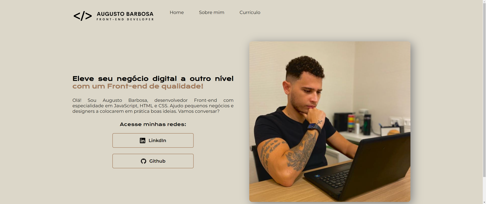
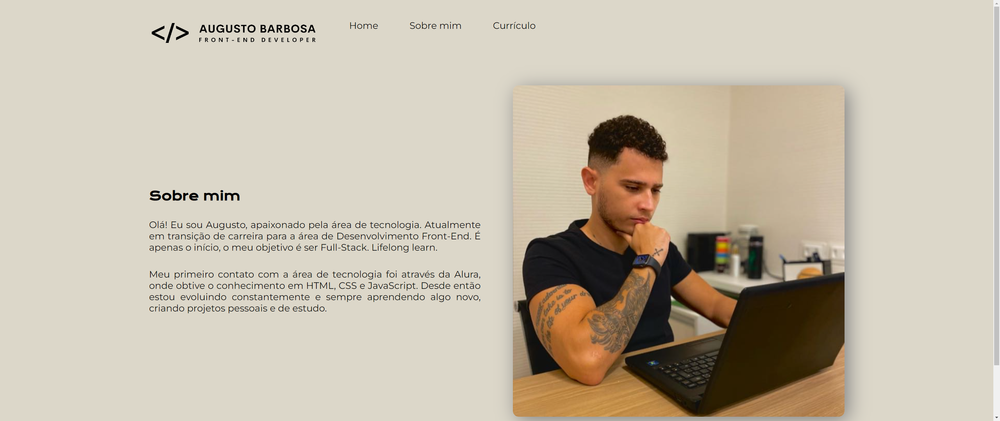
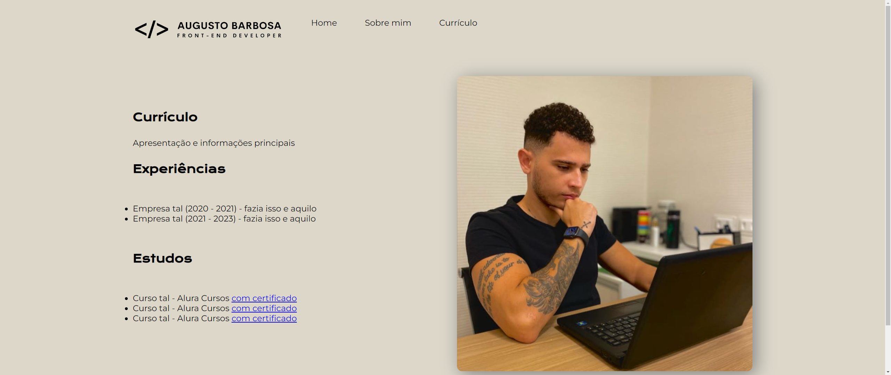

# Portfólio Augusto Barbosa

Portfólio Augusto Barbosa é o meu portfólio pessoal, onde tem informações sobre mim, minhas redes sociais e projetos.

## Técnicas e tecnologias utilizadas

    -`HTML`: O HTML tem um papel fundamental na marcação através de elementos, que foram utilizados pelo CSS.

    -`CSS`: O CSS ficou responsável pela estilização dos elementos usados no HTML.

    -`CSS Flexible Box Layout`: Para tornar todo o layout flexível.

## Página Web do projeto

[https://portfolio-ten-smoky-58.vercel.app/index.html](https://portfolio-ten-smoky-58.vercel.app/index.html)

## Abrir o projeto

Basta abrir o arquivo `index.html` no navegador.